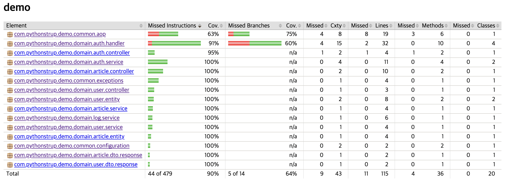

# Spring Boot Boilerplate

## Description

- Article Entity is For Redis
- User Entity is For MySQL JPA

## Dependencies

- Spring Boot DevTools
- Spring Web
- Spring Security
- Spring Data JPA
- MySQL Driver
- Spring Data Redis(Access+Driver)
- Spring Validation
- Spring AOP
- Lombok
- Swagger

## Tech

- Docker 
- Docker Compose
- Session
- JUnit

## How To Build

- To make `build/libs`

```shell
$ ./gradlew build
```

- Start by Docker-Compose

```shell
$ docker-compose -f docker-compose.local.yml up -d --build
```

# Swagger URL

- UI Form

```
server:port/swagger-ui
```

- JSON Form

```
server:port/api-docs
```

# Code Coverage

